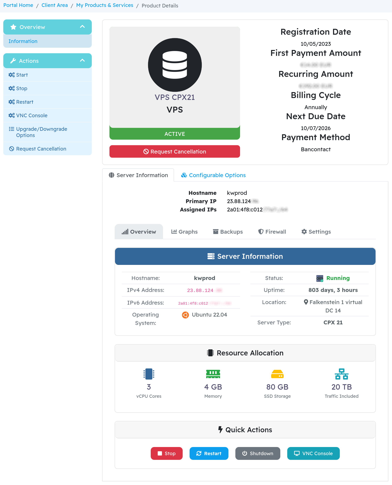
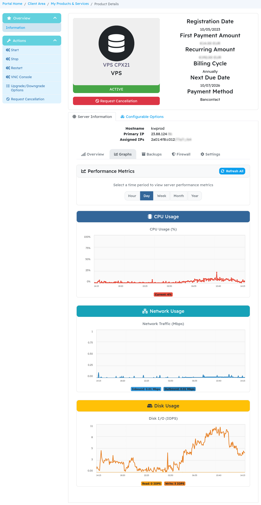
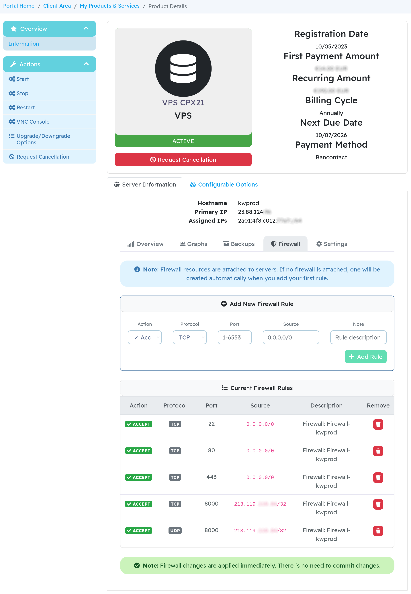
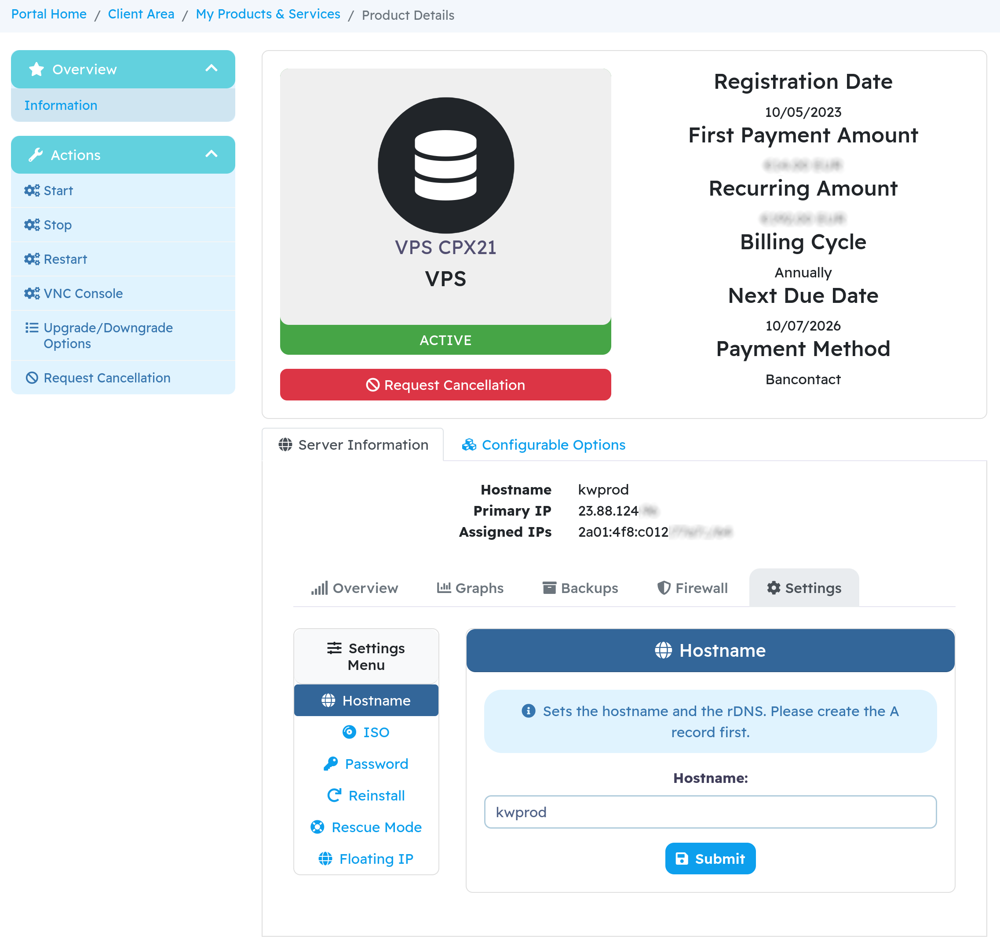
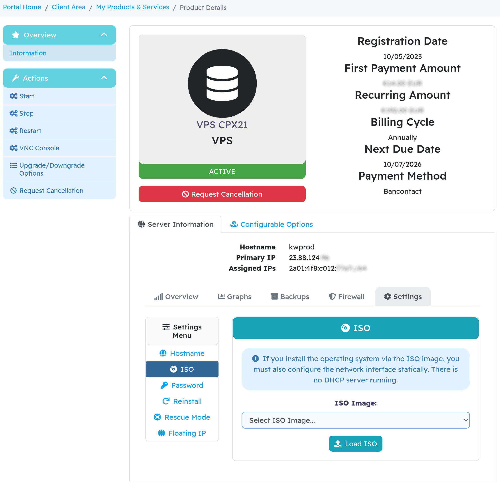
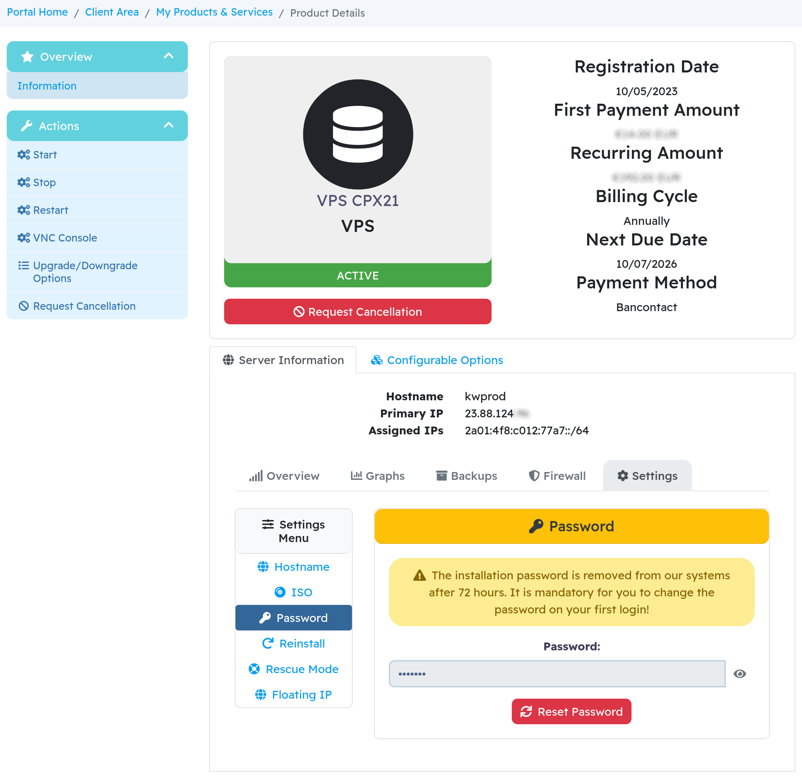
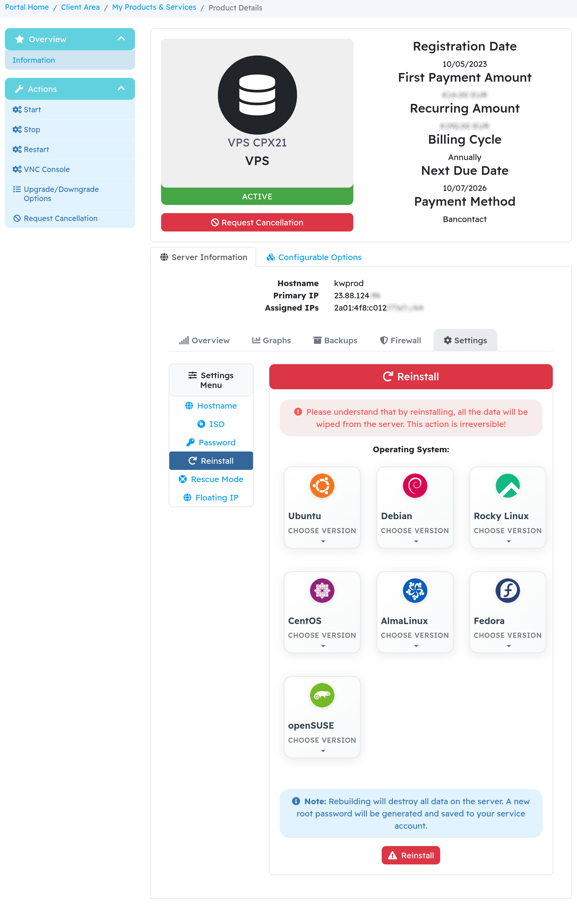
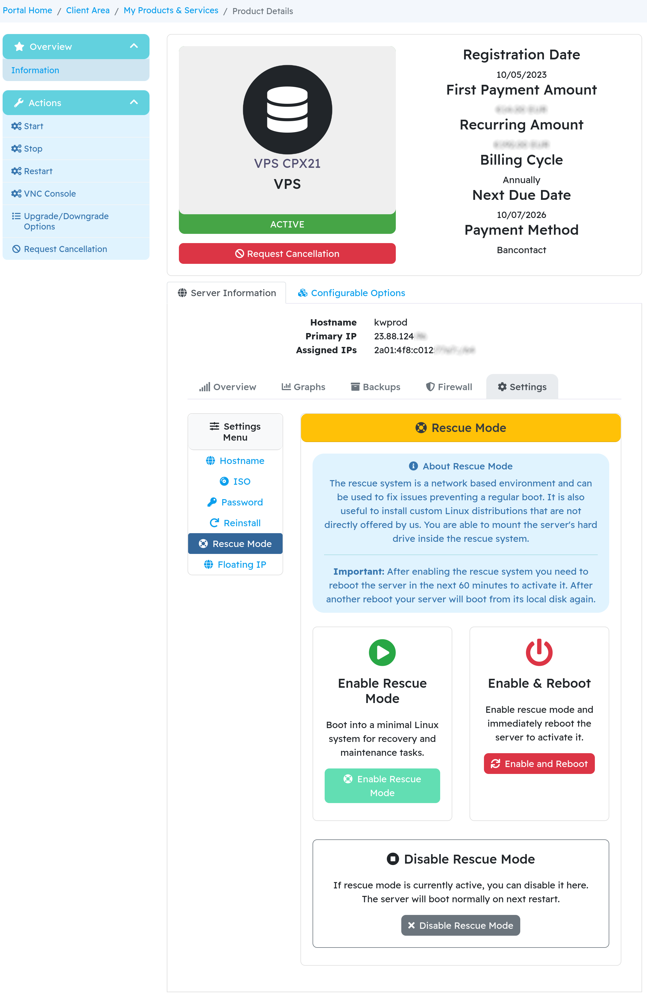
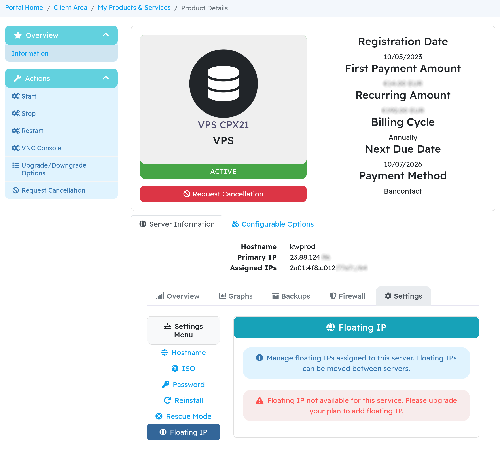

# ArkHost Hetzner VPS Module

WHMCS server module for Hetzner Cloud VPS management.

## Features

**Core**

- VPS lifecycle: create, suspend, unsuspend, terminate
- Server control: start, stop, restart, shutdown
- Automatic provisioning on payment

**Advanced**

- Floating IP management with reverse DNS
- Backup creation and restoration
- Firewall rule management
- Performance graphs (CPU, network, disk I/O)
- Rescue mode with temporary passwords
- ISO mounting
- OS reinstallation

**Interface**

- Bootstrap 4 responsive design
- Multiple language translations included
- Real-time status updates
- VNC console access

## Requirements

- WHMCS 8.9+
- PHP 7.4+
- Hetzner Cloud API token
- cURL extension
- HTTPS connection

## Installation

1. Upload files to `/path/to/whmcs/modules/servers/ArkHostHetznerVPS/`
2. Create server and add it to a server group:
    - Setup → Products/Services → Servers → Create New Group
    - Name: `Hetzner Cloud`
    - Type: `ArkHostHetznerVPS`
    - Hostname: `localhost`
    - Username: Hetzner Project ID (optional)
    - Password: Hetzner Cloud API Token
3. Create products:
    - Setup → Products/Services → Products/Services → Create New Product
    - Type: `VPS/Dedicated Server`
    - Module: `ArkHostHetznerVPS`
    - Server Group: Select Hetzner Cloud

## Configuration

**Module Settings**

- Server Type: `cx11`, `cx21`, `cx31`, `cx41`, `cx51` , etc.
- Operating System: `ubuntu-20.04`, `debian-11`, etc.
- Datacenter: `fsn1`, `nbg1`, `hel1`, `ash`, `hil`
- Backups: On/Off
- Create Floating IP: On/Off

**Custom Field (Required)**

- Field Name: `ArkHostHetznerVPS|VPS ID`
- Type: Text Box
- Admin Only: Yes

For ModulesGarden migration, keep existing `serverID|Server ID` field.

## Configurable Options

Create in Setup → Products/Services → Configurable Options:

**1\. Floating IP Add-on**

- Option Name: `Floating IP`
- Option Type: `Yes/No`
- Options:
    - `No|None`
    - `Yes|1 Floating IP`

**2\. Datacenter Selection**

- Option Name: `datacenter`
- Option Type: `Dropdown`
- Options:
    - `fsn1|Falkenstein, Germany`
    - `nbg1|Nuremberg, Germany`
    - `hel1|Helsinki, Finland`
    - `ash|Ashburn, USA`
    - `hil|Hillsboro, USA`

**3\. Server Type**

- Option Name: `planid`
- Option Type: `Dropdown`
- Options:
    - `cx11|CX11 (1 vCPU, 2GB RAM, 20GB SSD)`
    - `cx21|CX21 (2 vCPU, 4GB RAM, 40GB SSD)`
    - `cx31|CX31 (2 vCPU, 8GB RAM, 80GB SSD)`
    - `cx41|CX41 (4 vCPU, 16GB RAM, 160GB SSD)`
    - `cx51|CX51 (8 vCPU, 32GB RAM, 240GB SSD)`

**4\. Operating System**

- Option Name: `osid`
- Option Type: `Dropdown`
- Options:
    - `ubuntu-20.04|Ubuntu 20.04 LTS`
    - `ubuntu-22.04|Ubuntu 22.04 LTS`
    - `debian-11|Debian 11`
    - `debian-12|Debian 12`
    - `centos-stream-8|CentOS Stream 8`
    - `centos-stream-9|CentOS Stream 9`
    - `rocky-8|Rocky Linux 8`
    - `rocky-9|Rocky Linux 9`

  

## Client Interface

**Overview**: Server status, information, control buttons **Graphs**: CPU, network, disk I/O monitoring **Backups**: Create, restore, delete backups **Settings**: Hostname, ISO, password reset, reinstall, firewall, rescue mode, floating IP

## SSH Key Management

**Why no SSH key feature?**

Hetzner's API stores SSH keys at the project level, not per-server. In a multi-tenant WHMCS environment, this creates security risks:

- Potential key exposure across customers
- No proper isolation between services
- Complex workarounds that compromise security

**Current recommended approach:**

1. Use password authentication for initial access
2. Add your SSH key manually: `ssh-copy-id root@your-server-ip`
3. Secure your server:

```bash
sed -i 's/PasswordAuthentication yes/PasswordAuthentication no/' /etc/ssh/sshd_configsystemctl restart sshd
```

This ensures proper key isolation and security for each customer.

**Future development:**

We're exploring secure implementations using cloud-init or per-server user data to enable SSH key management while maintaining proper isolation.

## Screenshots











## Troubleshooting

**API Connection Failed**: Check API token in server group settings **Server Not Found**: Verify VPS ID custom field exists **Floating IP Issues**: Enable in configurable options

Enable module debugging: Configuration → System Logs → Module Log

## Support Policy

This is free, open-source software provided AS-IS.

**NO SUPPORT** is provided except through paid channels:
- Premium Support: €100/hour (2 hour minimum)
- Email: support@arkhost.com (paid support only)

### Before Requesting Support
- English only
- Must provide complete error logs
- Must provide steps to reproduce
- Vague reports like "doesn't work" will be ignored

### GitHub Issues
- For documented bugs only
- Requires complete technical information
- Issues lacking proper information will be closed immediately
- This is not a support forum

If you need help with basic installation or configuration, purchase premium support.

## License

MIT License - see [LICENSE](LICENSE) file for details.

Free and open source. Commercial support available.

## Other ArkHost Modules

Check out our other WHMCS modules at [arkhost.com/whmcs-modules.php](https://arkhost.com/whmcs-modules.php "https://arkhost.com/whmcs-modules.php")

© 2025 ArkHost

<br>
